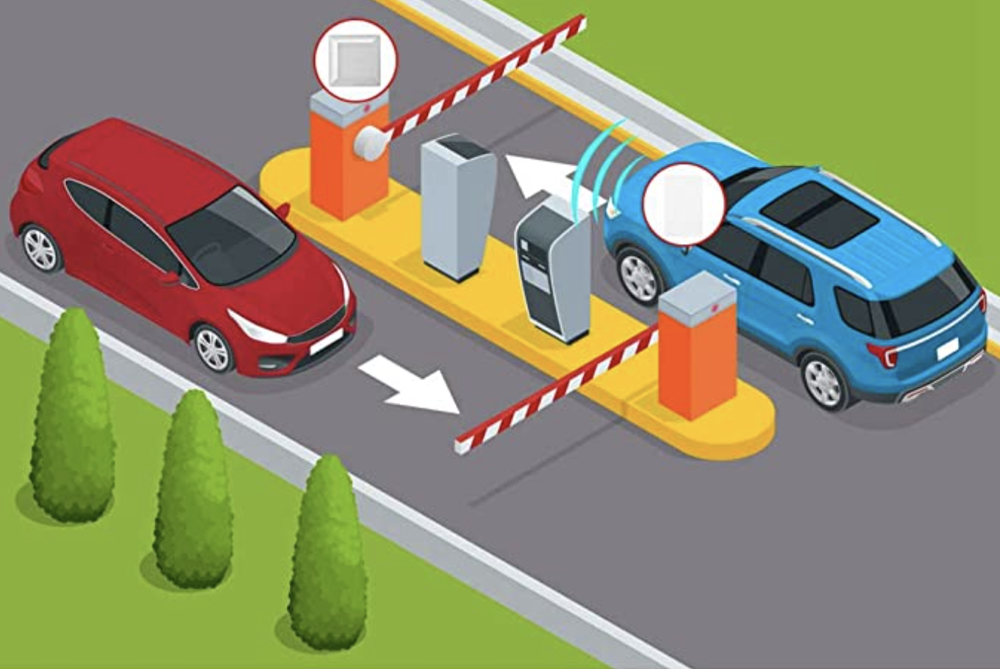
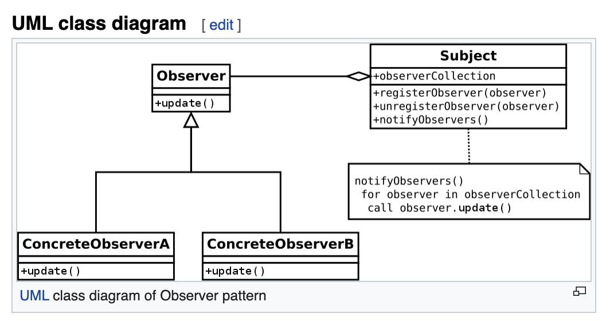

Deep dive into RXJS ❤️


Note: test note

---
RXJS
  * Reactive Programming
* Library using Observables (Observer pattern)
* Treating events
* Manipulating event with operators
* Like Lodash for async

---
Reactive



---
RXJS
* Reactive Programming
  * Library using Observables (Observer pattern)
* Treating events
* Manipulating event with operators
* Like Lodash for async

---
Observer



---

RXJS
* Reactive Programming
* Library using Observables (Observer pattern)
  * Treating events
* Manipulating event with operators

---
RXJS
* Reactive Programming
* Library using Observables (Observer pattern)
* Treating events
  * Manipulating event with operators

----

Before Observables, we used Promise...

```typescript
const computePayPeriodContract = new Promise(
    (resolve, reject) =>
        setTimeout(() => resolve({period: 'June 2020'})
            , 5000));

computePayPeriodContract.then(
    value => console.log(`Pay period contract: ${value.period}`),
    error => console.error(error)
);

```
----
Promise with chaining

```typescript
const computePayPeriodContract = new Promise(
    (resolve, reject) => 
        setTimeout(() => resolve({pay: 'June 2020'})
            , 5000));

const updateStatus = new Promise(
    (resolve, reject) =>
        setTimeout(() => resolve('Done'), 1000));

computePayPeriodContract
    .then(value => updateStatus, error => console.error(error))
    .then(status => console.log(`Contract status: ${status}`))
    .catch(error => console.error(error));

```
----

Promise

* Readonly Single future value
* Not lazy
* Immutable & uncancellable

---

Observable

```typescript
const myObservable = (observer) => {
    observer.next('🍕');
    const id = setTimeout(() => observer.complete(), 1000);
    
    return () => clearTimeout(id);
}

// const teardown = observable.subscribe() ;-)
const teardown = myObservable({
    next(value) {console.log(value);},
    error(error) {console.error(error);},
    complete() {console.info('Done');}
});

// setTimeout(() => teardown.unsubscribe(), 1000); ;-)
setTimeout(() => teardown(), 1000);
```

----
Observable

* Streams of any type of things and over any amount of time
* Lazy
* Cancellable

----
Operator

```typescript

const myMap = (observable, mapFn) => {
    (observer) => observable({
        next(value) {observer.next(mapFn(value));},
        error(error) {observer.error(error);},
        complete() {observer.complete();}
    })
};

const source = myMap(myObservable, o => o + '🍪');
source({ next(value) {console.log(value)} })

```

---

Let's code()


---

* [multicast](https://stackblitz.com/edit/rxjs-3ztwe3?file=index.ts) | [unicast](https://stackblitz.com/edit/rxjs-uq2e6d?file=index.ts)
* [switchMap | exhaustMap](https://stackblitz.com/edit/rxjs-2mvaax?file=index.ts)
* [catchError](https://stackblitz.com/edit/rxjs-aanbzo?file=index.ts)
* [concatMap | mergeMap](https://stackblitz.com/edit/rxjs-9kh2dv?file=index.ts)
* [combineLatest](https://stackblitz.com/edit/rxjs-arpcz6?file=index.ts)
* [forkJoin](https://stackblitz.com/edit/rxjs-swadhe?file=index.ts)

---
References

* [Tree decision](https://rxjs.dev/operator-decision-tree)
* [Rxviz](https://rxviz.com)

---


